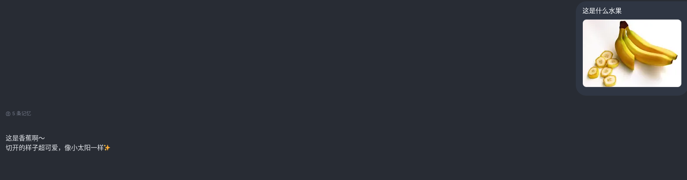

# Web2API

Web2API 是一个把网页端 AI 服务包装成 OpenAI / Anthropic 兼容接口的桥接服务。它通过真实浏览器维护网页会话，再向本地或内网客户端暴露标准 HTTP API，适合接入 OpenAI SDK、Cursor、Cherry Studio 等兼容 `/v1/chat/completions` 的客户端。

当前项目内置 `tongji` 插件，并保留通用插件架构，后续可以扩展其他网页服务。

## 功能

- OpenAI Chat Completions 兼容接口
- OpenAI Responses 兼容接口
- Anthropic Messages 兼容接口
- 流式和非流式响应
- 图片和文档附件
- 本地 PDF 路径 / 文件名识别，并用 `pdftotext` 注入正文
- tagged tool protocol 工具调用适配
- 浏览器会话复用
- Web 配置页：API Key、控制台密码、代理组、账号、模型等

## Alma 客户端实测

以下能力已通过 Alma 客户端调用验证：

- OpenAI Chat Completions 路由可被本地客户端直接调用。
- 同一客户端对话可复用同一网页会话，减少重复新开网页会话。
- 本地 Markdown / 代码文件路径可被识别并传入模型。
- 代码文件可以作为附件上传，模型能读取并解释文件内容。
- 图片输入可正常传入，模型能识别图片内容。
- 本地 PDF 文件名或路径可被识别，并通过 `pdftotext` 注入正文，模型不需要再自行搜索文件。

图片识别示例：



## 安全说明

这个项目会保存网页账号认证信息、代理配置和本地浏览器 profile。公开仓库里不要提交：

- `db.sqlite3`
- `docker-data/`
- `config.local.yaml`
- `.env`
- 浏览器 profile / cookies / storage state
- 真实账号、密码、sessionKey、API key、代理账密
- 调试日志和真实对话内容

仓库里的 `config.yaml` 是安全默认模板。实际运行时建议使用自动生成的 `config.local.yaml`，它已被 `.gitignore` 忽略。

## 快速开始

### 方式一：源码启动

环境要求：

- Python 3.12+
- 推荐安装 [uv](https://github.com/astral-sh/uv)
- 可启动的 Chromium / fingerprint-chromium
- Linux 下如果需要 PDF 正文提取，安装 `poppler-utils`

Linux / macOS：

```bash
git clone https://github.com/<your-name>/web2api.git
cd web2api
./start.sh
```

Windows：

```bat
git clone https://github.com/<your-name>/web2api.git
cd web2api
start.bat
```

脚本会自动：

- 复制 `config.yaml` 为 `config.local.yaml`
- 使用 `uv sync` 安装依赖；没有 `uv` 时退回 `.venv + pip`
- 启动 `main.py`

启动后访问：

- 配置页：`http://127.0.0.1:9000/login`
- API：`http://127.0.0.1:9000`

首次访问 `/login` 会要求设置控制台密码。

### 方式二：Docker Compose

```bash
docker compose up -d --build
```

数据会保存到本地 `./docker-data`，包括：

- `/data/config.yaml`
- `/data/db.sqlite3`
- 浏览器 profile
- 运行时状态

启动后访问：

- `http://127.0.0.1:9000/login`
- `http://127.0.0.1:9000/config`

Docker 镜像内置：

- Python 运行环境
- fingerprint-chromium
- Xvfb 虚拟显示
- `poppler-utils`，用于 `pdftotext`

## 配置

配置加载优先级：

1. `WEB2API_CONFIG_PATH`
2. `config.local.yaml`
3. `config.yaml`

常用配置：

```yaml
server:
  host: '127.0.0.1'
  port: 9000

auth:
  api_key: ''
  config_secret: ''

browser:
  chromium_bin: ''
  headless: false
  no_sandbox: false
  disable_gpu: false
```

说明：

- `auth.api_key` 为空时使用默认值 `tongji-api-key`
- `auth.config_secret` 为空时，首次访问 `/login` 初始化控制台密码
- `browser.chromium_bin` 为空时使用代码默认路径；建议在配置页或 `config.local.yaml` 中改成你的 Chromium 路径
- Docker 内默认使用 `/opt/fingerprint-chromium/chrome`

更多配置见 [docs/config.md](docs/config.md)。

## 添加账号

启动后进入：

```text
http://127.0.0.1:9000/config
```

在配置页中设置：

- API Key
- 代理组
- 账号信息
- 模型映射
- 浏览器参数

账号认证字段由具体插件决定。内置 `tongji` 插件支持在配置页登录和保存账号。

## API 示例

默认 API Key：

```text
tongji-api-key
```

OpenAI Chat Completions：

```bash
curl -s "http://127.0.0.1:9000/openai/tongji/v1/chat/completions" \
  -H "Authorization: Bearer tongji-api-key" \
  -H "Content-Type: application/json" \
  -d '{
    "model": "glm-5.1",
    "stream": false,
    "messages": [
      {"role": "user", "content": "你好，介绍一下你自己"}
    ]
  }'
```

OpenAI Responses：

```bash
curl -s "http://127.0.0.1:9000/openai/tongji/v1/responses" \
  -H "Authorization: Bearer tongji-api-key" \
  -H "Content-Type: application/json" \
  -d '{
    "model": "glm-5.1",
    "input": "用三句话解释 Web2API"
  }'
```

Anthropic Messages：

```bash
curl -s "http://127.0.0.1:9000/anthropic/tongji/v1/messages" \
  -H "x-api-key: tongji-api-key" \
  -H "Content-Type: application/json" \
  -d '{
    "model": "glm-5.1",
    "max_tokens": 1024,
    "messages": [
      {"role": "user", "content": "你好"}
    ]
  }'
```

本地 PDF 总结：

```bash
curl -s "http://127.0.0.1:9000/openai/tongji/v1/chat/completions" \
  -H "Authorization: Bearer tongji-api-key" \
  -H "Content-Type: application/json" \
  -d '{
    "model": "glm-5.1",
    "messages": [
      {"role": "user", "content": "总结这个 PDF\n/home/user/papers/example.pdf"}
    ]
  }'
```

## 路由

OpenAI：

- `GET /openai/{provider}/v1/models`
- `POST /openai/{provider}/v1/chat/completions`
- `POST /openai/{provider}/v1/responses`
- `POST /openai/{provider}/v1/embeddings`

Anthropic：

- `GET /anthropic/{provider}/v1/models`
- `GET /anthropic/{provider}/v1/models/{model_id}`
- `POST /anthropic/{provider}/v1/messages`

配置页：

- `GET /login`
- `GET /config`
- `GET /api/config`
- `PUT /api/config`
- `POST /api/admin/login`
- `POST /api/admin/logout`

## 开发

安装依赖：

```bash
uv sync
```

检查：

```bash
uv run ruff check .
uv run pytest
```

Mock 服务：

```bash
uv run python main_mock.py
```

## Docker 检查

本地构建：

```bash
docker compose build
docker compose up -d
docker compose logs -f
```

如果浏览器启动失败，优先检查：

- `docker-data/config.yaml` 中的 `browser.chromium_bin`
- 容器 `shm_size` 是否足够
- 是否需要 `browser.no_sandbox: true`
- 是否需要 `browser.disable_gpu: true`

## 项目结构

```text
core/api/        OpenAI / Anthropic 兼容路由
core/plugin/     网页服务插件
core/runtime/    浏览器、tab、会话调度
core/config/     配置和 SQLite 持久化
docker/          Docker 默认配置和入口脚本
docs/            设计与接口文档
tests/           测试
```
